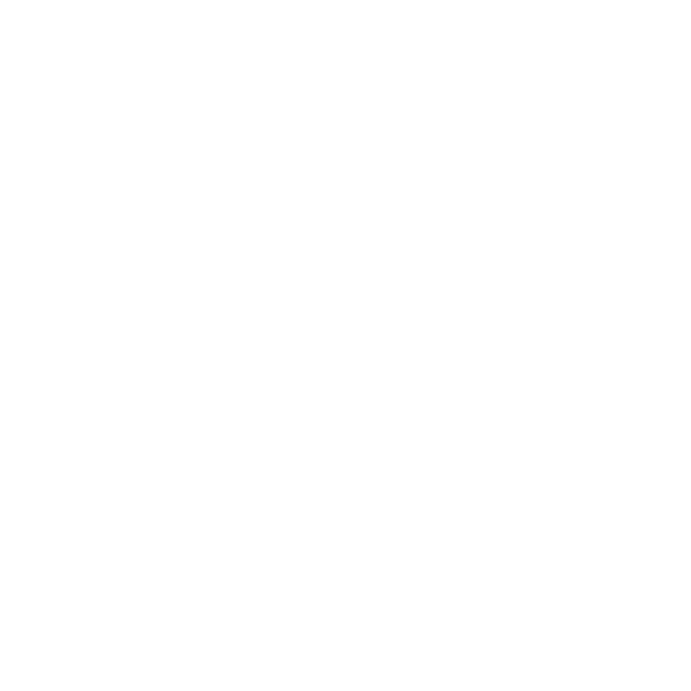

<!-- PROFILE README — Raffa-shi -->

  

<h1 align="center">Hi, I'm Raffa </h1>

  

  
  

  

---

## 👤 About Me
- 🔭 Current focus: **Machine Learning experiments for network prediction**
- 🌱 Currently learning: **supervised learning, model evaluation, and end-to-end ML pipeline**
- 🧠 Interested in: **data-driven prediction, analytics, and real-world implementation**
- 💬 Ask me about: **Machine Learning, backend development, databases, or K-pop (NMIXX)**

---

## Skills and Tools
Berikut teknologi yang saya gunakan 
### 🧠 Data Science / Machine Learning

  
  
  
  
  
  

---
### 🗄️ Backend / Database

  
  

---

### 🌐 API / Framework

  
  
  

Framework ini saya gunakan agar model ML bisa diakses melalui API (deployment).

---

### 💻 Programming Language

  
  
  

---

### 🎨 UI / Styling

  
  
  
  

---

### 🧑‍💻 Tools / Version Control

  
  

---

  

